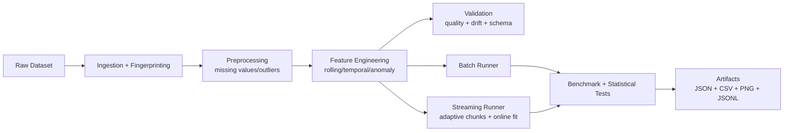

# NBA Data Preprocessing — Research-Grade, Hardware-Aware Real-Time Pipeline

This repository supports the original preprocessing contract and a modular, deployment-oriented ML data pipeline for AI + hardware research.

## What’s New (PASS-Level Upgrade)

- True incremental streaming path with chunk-level processing and no full feature concatenation in streaming mode.
- Adaptive chunk resizing under hard memory budget pressure, with retry + backpressure behavior.
- Optional disk spill mode for out-of-core workflows (`--spill-to-disk`).
- Online learning example in streaming mode using `SGDRegressor.partial_fit`.
- Hardware telemetry integration (CPU usage, process/system memory, optional Intel RAPL energy if available).
- Statistical rigor upgrades:
  - bootstrap confidence intervals,
  - permutation significance tests for batch vs streaming latency/throughput.
- Advanced data quality reports:
  - schema validation,
  - feature-wise numeric/categorical drift,
  - temporal drift analysis.
- Parallel constraint-experiment execution via `n_jobs`.
- Deterministic reproducibility controls (`random_seed`) and deterministic regression tests.
- CI workflow for tests, deterministic report checks, and artifact schema validation.

## System Architecture



## Backward Compatibility

The existing `preprocess.py` API remains available (`clean_data`, `feature_data`, `multicol_data`, `transform_data`).

## CLI Usage

Run from `NBA Data Preprocessing/task`:

```bash
python run_pipeline.py \
  --input ../data/nba2k-full.csv \
  --output-dir artifacts \
  --chunk-size 128 \
  --batch-size 256 \
  --max-memory-mb 512 \
  --max-compute-units 0.5 \
  --benchmark-runs 5 \
  --n-jobs 2 \
  --random-seed 42 \
  --spill-to-disk
```

## Generated Artifacts

- `artifacts/reports/pipeline_report.json`
- `artifacts/reports/streaming_chunks.jsonl`
- `artifacts/reports/constraint_experiment_log.jsonl`
- `artifacts/benchmarks/streaming_chunks.csv`
- `artifacts/benchmarks/significance_tests.csv`
- `artifacts/benchmarks/latency_vs_data_size.csv`
- `artifacts/benchmarks/throughput_vs_memory.csv`
- `artifacts/benchmarks/resource_vs_accuracy.csv`
- `artifacts/benchmarks/constraint_experiment.csv`
- `artifacts/benchmarks/latency_vs_accuracy.png`
- `artifacts/benchmarks/memory_vs_accuracy.png`
- `artifacts/benchmarks/latency_memory_accuracy.png`

These support edge-AI and telemetry-oriented narratives:
- streaming vs batch trade-offs,
- latency/memory/accuracy frontiers,
- constrained deployment analysis aligned with semiconductor/embedded systems contexts.

## Testing

Run from `NBA Data Preprocessing/task`:

```bash
python -m unittest discover -s test -p 'test_*.py'
```

## CI

GitHub Actions workflow validates:
- unit tests,
- deterministic fingerprint consistency,
- report schema/required fields,
- streaming and benchmark artifacts.

## License

MIT License.
