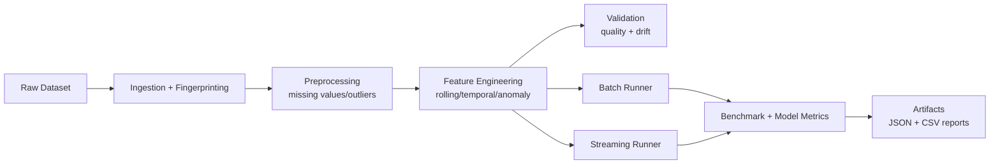

# NBA Data Preprocessing — Research-Grade, Hardware-Aware Real-Time Pipeline

This repository now supports both the original preprocessing contract and a modular, deployment-oriented ML data pipeline suitable for AI + hardware research workflows.

## What’s New

- Modular architecture with reusable components:
  - `pipeline/ingestion/`
  - `pipeline/preprocessing/`
  - `pipeline/feature_engineering/`
  - `pipeline/validation/`
  - `pipeline/streaming/`
  - `pipeline/config.py`
- Deterministic preprocessing (seeded, stable ordering, reproducible artifacts).
- Batch + simulated streaming execution with incremental chunk processing.
- Hardware-aware adaptation of chunk/batch sizes under memory/compute constraints.
- Latency, throughput, memory, and energy estimation artifacts.
- Data-quality checks: missingness, outlier rate, lightweight drift score.
- Benchmarking rigor: multiple runs, mean/std/95% CI summaries.
- Constraint experiment across chunk size, memory, and compute budgets with downstream model impact analysis.
- Dataset fingerprinting (SHA256 over canonical CSV serialization).
- CLI entrypoint for repeatable experiments.

## System Architecture



## Backward Compatibility

The existing `preprocess.py` API remains available (`clean_data`, `feature_data`, `multicol_data`, `transform_data`) so prior functionality is preserved.

## CLI Usage

Run from `NBA Data Preprocessing/task`:

```bash
python run_pipeline.py \
  --input ../data/nba2k-full.csv \
  --output-dir artifacts \
  --chunk-size 128 \
  --batch-size 256 \
  --max-memory-mb 512 \
  --max-compute-units 0.5 \
  --benchmark-runs 5
```

## Generated Artifacts

- `artifacts/reports/pipeline_report.json`
- `artifacts/benchmarks/streaming_chunks.csv`
- `artifacts/benchmarks/latency_vs_data_size.csv`
- `artifacts/benchmarks/throughput_vs_memory.csv`
- `artifacts/benchmarks/resource_vs_accuracy.csv`
- `artifacts/benchmarks/constraint_experiment.csv`
- `artifacts/benchmarks/latency_vs_accuracy.png`
- `artifacts/benchmarks/memory_vs_accuracy.png`
- `artifacts/reports/constraint_experiment_log.jsonl`

These support:
- latency vs data size curves,
- throughput vs memory curves,
- resource vs model performance trade-off analysis,
- batch vs streaming energy/efficiency comparison.


## Constraint Experiment (Latency/Resource vs Model Performance)

The pipeline automatically runs a reproducible experiment over:
- varying chunk sizes,
- memory limits,
- compute constraints.

For each configuration, it logs:
- preprocessing latency,
- training time (linear regression),
- model accuracy (R²) and RMSE,
- peak memory footprint.

This directly supports analysis of **latency vs accuracy** and **memory vs accuracy** trade-offs for hardware-aware ML systems.

## Research Reproducibility Workflow

1. Record dataset fingerprint from report.
2. Fix config and random seed in `PipelineConfig`.
3. Run multiple benchmarks (`benchmark_runs`).
4. Report mean/std/CI95 for latency/throughput.
5. Archive generated artifacts and commit hash.

## Edge / Embedded AI Relevance

The hardware-aware mode mimics constrained deployment by scaling chunk and batch sizes based on available memory and compute budget. This makes the same preprocessing pipeline useful for server-class and edge-class experiments.

## Testing

Run from `NBA Data Preprocessing/task`:

```bash
python -m unittest discover -s test -p 'test_*.py'
```

## License

MIT License.
