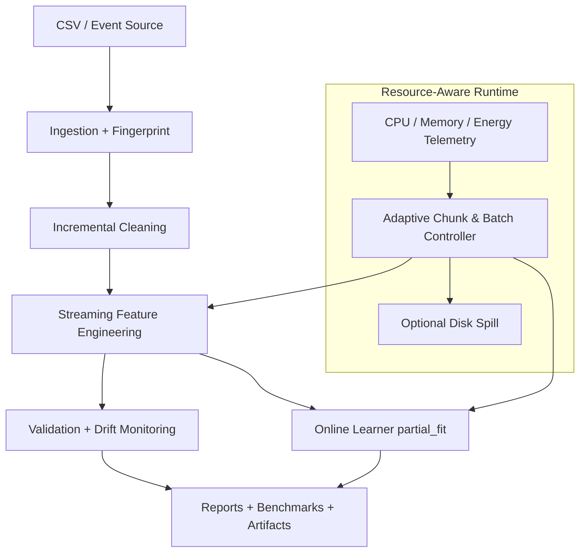

# Streaming and Real-Time Feature Engineering for Resource-Constrained ML Systems

This project delivers a modular data engineering system centered on **incremental processing, online learning, and hardware-aware execution**. It transforms NBA player data into production-grade ML features with both batch and streaming runtimes, while explicitly modeling edge and constrained deployment conditions.

## Project Focus

- **Streaming ML pipelines:** chunked ingestion, incremental preprocessing, and per-chunk telemetry.
- **Online learning:** streaming mode supports iterative model updates with `partial_fit`.
- **Real-time analytics:** captures latency, throughput, memory pressure, and energy estimates.
- **Edge deployment relevance:** adaptive control logic responds to memory/compute limits.

## Architecture Diagram



> Source diagram file: `docs/architecture.mmd`.

## Streaming Workflow

1. Ingest source and compute deterministic fingerprint.
2. Set starting chunk/batch sizes from memory and compute constraints.
3. Clean and feature-engineer each chunk incrementally.
4. Validate schema and quality, and collect telemetry snapshots.
5. Trigger adaptive resizing or retry if memory budget is exceeded.
6. Continue online training via per-chunk `partial_fit`.
7. Write chunk-level logs plus summary reports and benchmark datasets.

Detailed workflow notes: `docs/streaming_workflow.md`.

## Resource-Aware Pipeline Design

The runtime combines telemetry and control:

- **Memory-aware scaling** bounds chunk and batch sizes as budgets tighten.
- **Compute-aware scaling** modulates processing intensity for lower-power systems.
- **Adaptive retries** recover from chunk-level memory overages.
- **Disk spill mode** preserves progress under strict RAM ceilings.
- **Energy-aware reporting** includes optional RAPL energy when available, with fallback estimates.

## Configuration Templates

Prebuilt templates are provided for common deployment profiles:

- `configs/pipeline.edge.template.json`
- `configs/pipeline.server.template.json`

Run with a template:

```bash
cd "NBA Data Preprocessing/task"
python run_pipeline.py \
  --input ../data/nba2k-full.csv \
  --config-template ../../configs/pipeline.edge.template.json
```

> CLI values still apply and can be used to override template-backed runs.

## Reproducibility

- Set `random_seed` in configuration for deterministic fingerprints and benchmark reproducibility.
- Use fixed benchmark runs (`benchmark_runs`) when comparing hardware profiles.
- Store output artifacts per profile (`output_dir`) to preserve traceable experiment history.

Recommended reproducibility check:

```bash
cd "NBA Data Preprocessing/task"
python -m unittest discover -s test -p 'test_*.py'
```

## Benchmarking Guide

Example benchmark run:

```bash
cd "NBA Data Preprocessing/task"
python run_pipeline.py \
  --input ../data/nba2k-full.csv \
  --output-dir artifacts_benchmark \
  --chunk-size 128 \
  --batch-size 256 \
  --max-memory-mb 512 \
  --max-compute-units 0.5 \
  --benchmark-runs 5 \
  --n-jobs 2 \
  --spill-to-disk
```

Key outputs:

- `reports/pipeline_report.json`
- `reports/streaming_chunks.jsonl`
- `benchmarks/constraint_experiment.csv`
- `benchmarks/significance_tests.csv`
- `benchmarks/latency_vs_accuracy.png`

## Design Trade-Offs

- **Throughput vs. memory safety:** smaller chunks reduce memory peaks but increase orchestration overhead.
- **Latency vs. model fidelity:** aggressive constraint settings can reduce processing quality or online fit stability.
- **Disk spill vs. end-to-end delay:** spill mode protects continuity but introduces I/O latency.
- **Parallelism vs. determinism surface area:** more workers improve speed but expand runtime variability risks.

## Scaling Discussion

- **Vertical scaling:** increase `max_memory_mb`, `max_compute_units`, and `batch_size` for stronger hosts.
- **Constraint sweeps:** the built-in experiment runner explores chunk/memory/compute combinations and summarizes best operating points.
- **Parallel experiment execution:** `n_jobs > 1` accelerates constraint-space exploration.
- **Data-volume scaling:** benchmark exports include latency-vs-size and throughput-vs-memory curves to guide capacity planning.

## Hardware Relevance

This system is suitable for **resource-constrained and edge-aware ML data engineering** scenarios:

- Embedded and low-memory inference gateways.
- On-device feature pipelines preceding online model updates.
- Telemetry-informed tuning loops for CPU/memory/energy budgets.
- Comparative evaluation between edge-like and server-like configuration templates.

## License

MIT License.
