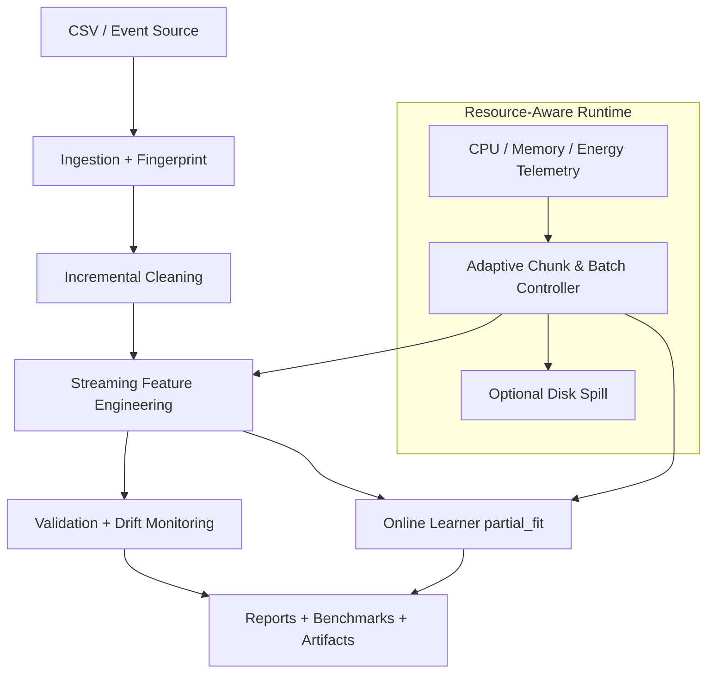

# NBA Data Preprocessing: Streaming Pipeline for Resource-Constrained Execution

This repository implements a deterministic data preprocessing and feature-engineering pipeline for the NBA2K salary dataset. The code supports two execution modes:

- **Batch mode** for full-dataset preprocessing and model evaluation.
- **Streaming mode** for chunked processing under explicit memory and compute constraints.

The implementation is intentionally conservative: compatibility with the existing CLI and module interfaces is preserved while adding reproducible telemetry and benchmark artifacts.

## System Design

The runtime is organized as a staged pipeline:

1. **Ingestion**: load source data and compute a SHA-256 dataset fingerprint.
2. **Preprocessing**: parse/normalize fields, handle missing values, and detect outliers.
3. **Feature engineering**: derive temporal and rolling features, then remove high-correlation inputs.
4. **Validation**: generate schema and drift checks.
5. **Evaluation and reporting**: train/evaluate models, run constraint experiments, and write artifacts.


```mermaid
flowchart TD
    SRC[CSV / Event Source] --> ING[Ingestion + Fingerprint]
    ING --> PREP[Incremental Cleaning]
    PREP --> FE[Streaming Feature Engineering]
    FE --> VAL[Validation + Drift Monitoring]
    FE --> ONLINE[Online Learner partial_fit]
    VAL --> STORE[Reports + Benchmarks + Artifacts]
    ONLINE --> STORE

    subgraph RUNTIME[Resource-Aware Runtime]
      MON[CPU / Memory / Energy Telemetry]
      CTRL[Adaptive Chunk & Batch Controller]
      SPILL[Optional Disk Spill]
    end

    MON --> CTRL
    CTRL --> FE
    CTRL --> ONLINE
    CTRL --> SPILL
```

Source diagram: `docs/architecture.mmd`.

## Design Motivations and Trade-Offs

- **Determinism over maximum throughput**: seeded runs and fixed artifact naming improve reproducibility but can reduce peak speed.
- **Adaptive chunk sizing over static sizing**: memory failures are reduced, but per-chunk control logic adds overhead.
- **Spill-to-disk resilience over latency**: constrained devices can finish runs, but I/O amplification increases wall-clock time.
- **Parallel benchmark execution over strict timing stability**: `n_jobs > 1` accelerates sweeps while increasing timing variance.

## Performance Constraints and Failure Modes

Common bottlenecks and failure modes:

- CSV ingestion is I/O-bound on slower storage.
- One-hot expansion can increase memory pressure for high-cardinality categories.
- Small chunks improve memory safety but increase scheduler and model update overhead.
- RAPL energy counters may be unavailable in containers or non-Intel hosts; fallback estimation is used.
- Overly strict compute limits can reduce model quality due to aggressive downscaling.

## Assumptions

- Input data contains required columns: `version`, `salary`, `b_day`, `draft_year`, `height`, `weight`.
- The runtime can create output directories under `output_dir`.
- Python dependencies in `requirements.txt` are installed.
- Streaming and batch runs operate on the same schema.

## Limitations

- Current dataset versioning is file-fingerprint based, not registry-backed.
- Operator profiling is stage-level and chunk-level; no kernel-level tracing is included.
- Energy telemetry uses optional RAPL; platforms without RAPL rely on a coarse fallback estimate.
- The baseline model is linear regression and does not represent all modeling scenarios.

## Configuration Templates

- `configs/pipeline.edge.template.json`
- `configs/pipeline.server.template.json`

Run with a template:

```bash
cd "NBA Data Preprocessing/task"
python run_pipeline.py \
  --input ../data/nba2k-full.csv \
  --config-template ../../configs/pipeline.edge.template.json
```

CLI arguments remain backward compatible and can override template values.

## Reproducibility

- Set `random_seed` in config or CLI.
- Keep `benchmark_runs` fixed when comparing runs.
- Store artifacts in distinct `output_dir` values.

Validation command:

```bash
cd "NBA Data Preprocessing/task"
python -m unittest discover -s test -p 'test_*.py'
```

## Benchmark Artifacts

Each full run writes:

- `reports/pipeline_report.json`
- `reports/streaming_chunks.jsonl`
- `benchmarks/constraint_experiment.csv`
- `benchmarks/significance_tests.csv`
- `benchmarks/latency_vs_accuracy.png`
- `benchmarks/memory_vs_accuracy.png`
- `benchmarks/latency_memory_accuracy.png`
- `profiles/operator_profile.csv`

Hardware profiling guide: `docs/hardware_profiling.md`.

## Deployment Notes

- For edge-like hosts, reduce `chunk_size`, `batch_size`, and `max_memory_mb`.
- For server-like hosts, increase `max_memory_mb` and `n_jobs` for faster sweeps.
- Persist reports and benchmark CSV/plots to external storage for longer experiment history.

## License

MIT License.
